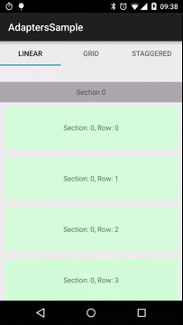

# Extended RecyclerView Adapters

Library contains set of custom RecycleView Adapters that extending base adapter functionality.

Demo using `BaseStickySectionRecyclerViewAdapter`



## Download
//todo

### BaseRecyclerViewAdapter

Extended `RecyclerView.Adapter` that contains few new features:

- Infinite scrolling - Adds loading spinner at the end of the list and informs when user reaches the last adapter item.
- Bottom content inset - Adds an empty item with specified height at the beginning and at the end of the list
- Top content inset - Adds an empty item with specified height at the beginning and at the begin of the list

#### Usage

Create your own Adapter class that extends `BaseRecyclerViewAdapter`, example:

```
public class Adapter extends BaseRecyclerViewAdapter<RowViewHolder>{

    @Override
    protected int getDataCount() {
        return dataList.size();
    }

    @Override
    protected RowViewHolder createHolderForLayoutResId(@LayoutRes int layoutResId, View itemView) {
        return new RowViewHolder(itemView);
    }

    @Override
    protected void onBindDataViewHolder(RowViewHolder holder, int dataPosition) {
        holder.textView.setText(dataList.get(dataPosition));
    }

    @Override
    protected int getDataViewLayoutResId(int dataPosition) {
        return R.layout.item_row;
    }
    
    @Override
    protected int getInfiniteScrollingLayoutResId() {
        return R.layout.item_infinite_scrolling;
    }

    public static class RowViewHolder extends RecyclerView.ViewHolder {

        public TextView textView;

        public RowViewHolder(View itemView) {
            super(itemView);
            textView = (TextView) itemView.findViewById(R.id.text_view);
        }
    }
}
```

To configure topContentInset, bottomContentInset and infiniteScrolling call:

```
	adapter.setTopContentInset(topContentInset);
	adapter.setBottomContentInset(bottomContentInset);
	adapter.setInfiniteScrollingListener(new InfiniteScrollingListener() {
            @Override
            public void onInfiniteScrollingLoadMore(BaseRecyclerViewAdapter adapter) {
                loadNextPage();
            }
        });
	adapter.setInfiniteScrollingEnabled(true);
```

Remember to set `BaseSpanSizeLookup` for GridLayoutManager (it is needed to make infinity, top inset & bottom inset views to be full spaned).

```
	GridLayoutManager layout = new GridLayoutManager(getActivity(), fullSpanSize);
	layout.setSpanSizeLookup(new BaseSpanSizeLookup(getAdapter(), fullSpanSize) {
		@Override
		protected int getDataSpanSize(int dataPosition) {
			return defaultSpanSize;
		}
	});
	recyclerView.setLayoutManager(layout);
```

You don't have to do anything with StaggeredGridLayoutManager. `BaseRecyclerViewAdapter` handle spans itself.

### BaseSectionRecyclerViewAdapter

Extended `BaseRecyclerViewAdapter` that adds abstraction for grouping items in specified sections. Implementation is very similar to iOS UITableView.

#### Usage

Create your own Adapter class that extends BaseSectionRecyclerViewAdapter, example:

```
public class SectionAdapter extends BaseSectionRecyclerViewAdapter {

    @Override
    protected boolean hasSectionHeader(int section) {
        return true;
    }

    @Override
    protected int getSectionCount() {
        return sectionList.size();
    }

    @Override
    protected int getRowCount(int section) {
        return sectionList.get(section).size();
    }

    @Override
    protected int getSectionHeaderLayoutResId(int section) {
        return R.layout.item_header;
    }

    @Override
    protected int getRowLayoutResId(IndexPath indexPath) {
		return R.layout.item_row;
    }

    @Override
    protected void onBindSectionHeaderViewHolder(RecyclerView.ViewHolder holder, int section) {
        HeaderViewHolder headerViewHolder = (HeaderViewHolder) holder;
        headerViewHolder.textView.setText(sectionList.get(section).getTitle());
    }

    @Override
    protected void onBindRowViewHolder(RecyclerView.ViewHolder holder, IndexPath indexPath) {
        RowViewHolder rowViewHolder = (RowViewHolder) holder;
        rowViewHolder.textView.setText(sectionList.get(indexPath).getTitle());
    }

    @Override
    protected RecyclerView.ViewHolder createHolderForLayoutResId(@LayoutRes int layoutResId, View itemView) {
        switch (layoutResId) {
            case R.layout.item_header:
                return new HeaderViewHolder(itemView);
            case R.layout.item_row:
                return new RowViewHolder(itemView);
        }
        throw new IllegalStateException("Cannot create view holder for layoutResId = " + layoutResId);
    }
}
   
```

### BaseStickySectionRecyclerViewAdapter

Extended `BaseSectionRecyclerViewAdapter` that uses [sticky-headers-recyclerview](https://github.com/timehop/sticky-headers-recyclerview) library to show sticky headers. <p/>
Create your own adapter that extends `BaseStickySectionRecyclerViewAdapter`, example:

```
public class StickyHeadersAdapter extends BaseStickySectionRecyclerViewAdapter {

	@Override
    protected int getSectionHeaderLayoutResId() {
        return R.layout.item_header;
    }

    @Override
    protected long getSectionItemViewId(int section) {
        return section;
    }

    @Override
    protected int getSectionCount() {
        return sectionData.size();
    }

    @Override
    protected int getRowCount(int section) {
        return sectionData.get(section).size();
    }

    @Override
    protected int getRowLayoutResId(IndexPath indexPath) {
        return R.layout.item_row;
    }

    @Override
    protected RecyclerView.ViewHolder createHolderForLayoutResId(@LayoutRes int layoutResId, View itemView) {
        switch (layoutResId) {
            case R.layout.item_header:
                return new HeaderViewHolder(itemView);
            case R.layout.item_row:
                return new RowViewHolder(itemView);
        }
        throw new IllegalStateException("Cannot create view holder for layoutResId = " + layoutResId);
    }

    @Override
    protected void onBindSectionHeaderViewHolder(RecyclerView.ViewHolder holder, int section) {
        HeaderViewHolder headerViewHolder = (HeaderViewHolder) holder;
        headerViewHolder.textView.setText("Section " + section);
    }

    @Override
    protected void onBindRowViewHolder(RecyclerView.ViewHolder holder, IndexPath indexPath) {
        String data = sectionData.get(indexPath.getSection()).get(indexPath.getRow());

        RowViewHolder rowViewHolder = (RowViewHolder) holder;
        rowViewHolder.textView.setText(data);
    }
}
```

Remember to call `configureStickyHeaderDecoration` method, with created `StickyRecyclerHeadersDecoration` parameter, on adapter:

```
recyclerView = ...
adapter.configureStickyHeaderDecoration(recyclerView, new StickyRecyclerHeadersDecoration(getAdapter()));
recyclerView.setAdapter(adapter);
```

## Used libraries

* **[sticky-headers-recyclerview]** https://github.com/timehop/sticky-headers-recyclerview
* **[spock]** https://code.google.com/p/spock/
* **[android support library v4 v7]** http://developer.android.com/tools/support-library/index.html

## LICENSE

[LICENSE](./LICENSE)